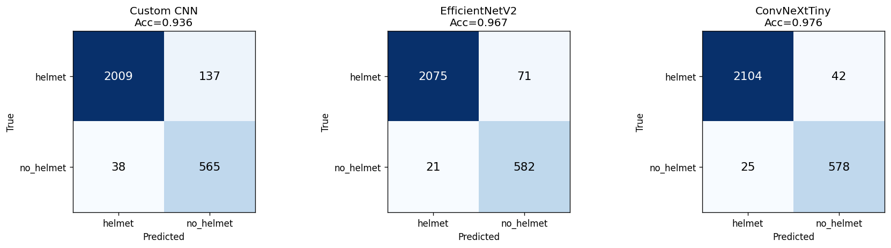
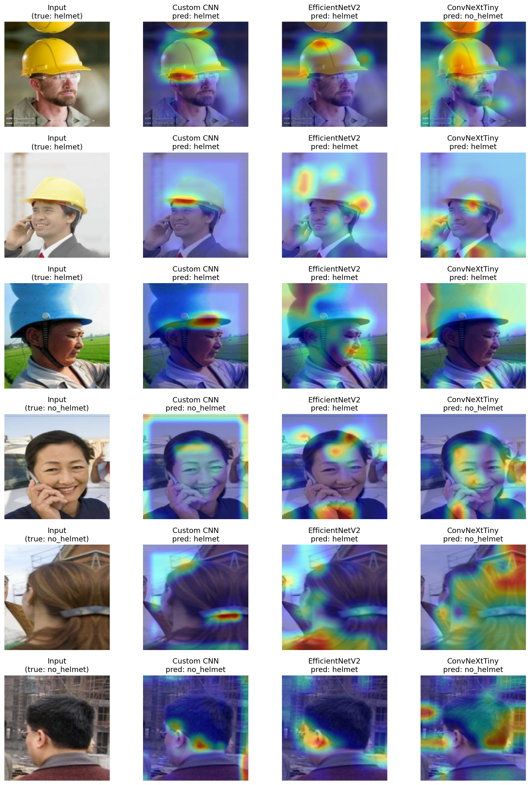
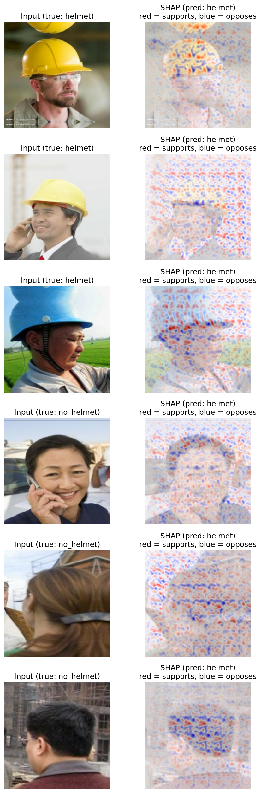

# Explainable Helmet-Use Classification

Deep learning project for classifying whether a person is wearing a helmet, with explainability analysis using Grad-CAM and SHAP. Developed as a final project for the Machine Learning & Smart Systems course.

## Overview

Three convolutional neural network models are trained to classify cropped images into two classes: **helmet** and **no_helmet**. Beyond raw accuracy, the project focuses on *explainability* — visualizing where each model "looks" when making a decision.

## Dataset

The models are trained on bounding-box crops extracted from a YOLO-format helmet detection dataset. Each detected head/rider region is cropped with 20% padding and labeled as helmet or no_helmet. This produces a 2-class image classification dataset, split 70/15/15 (train/validation/test) in a stratified manner.

## Models

| Model | Accuracy | Macro-F1 | No-Helmet Recall | Inference (ms) | Size (MB) | Parameters |
|---|---|---|---|---|---|---|
| Custom CNN (from scratch) | 0.9363 | 0.9121 | 0.9370 | 3.45 | 4.9 | 423,490 |
| EfficientNetV2-B0 (transfer) | 0.9665 | 0.9525 | 0.9652 | 4.79 | 38.5 | 6,083,538 |
| ConvNeXt-Tiny (transfer) | 0.9756 | 0.9648 | 0.9585 | 12.93 | 235.0 | 27,918,818 |

### Confusion Matrices



## Key Findings

- **Transfer learning clearly outperforms the from-scratch model**, confirming the value of ImageNet pretraining. ConvNeXt-Tiny achieves the highest accuracy (97.6%).
- **Highest accuracy does not always mean the safest model.** For helmet enforcement, the *no-helmet recall* (catching violations) matters most — and EfficientNetV2 leads on that metric.
- **The accuracy gain comes at a cost:** ConvNeXt-Tiny is ~48× larger and ~3× slower than the Custom CNN for a modest accuracy improvement, a key deployment trade-off.
- **Grad-CAM and SHAP reveal where models attend.** Most predictions correctly focus on the helmet region, but some cases show attention drifting to the background — a useful warning about model reliability.

## Explainability

Two complementary XAI techniques are used to interpret the models.

### Grad-CAM

Highlights the image regions most responsible for each prediction.



### SHAP

Shows per-pixel contributions supporting (red) or opposing (blue) the prediction.



## Live Demo

An interactive demo is available on Hugging Face Spaces, where you can upload an image and see predictions from both lightweight models along with their Grad-CAM heatmaps:

**https://huggingface.co/spaces/efeyalcin/helmet-classification-xai**

## Repository Contents

- `helmet_classification_xai.ipynb` — full notebook (data preparation, training, evaluation, Grad-CAM, SHAP)
- `app.py` — source code for the Hugging Face Spaces demo (Gradio)
- `requirements.txt` — Python dependencies
- `figures/` — generated figures (confusion matrices, Grad-CAM, SHAP)

## Tech Stack

TensorFlow / Keras, scikit-learn, SHAP, OpenCV, Gradio.

## How to Run

The notebook is designed to run on Kaggle with a GPU accelerator (internet enabled for ImageNet weights). To run the demo locally, place `custom_cnn.keras` and `efficientnetv2.keras` (available from the Hugging Face Space) in the project root, then:

```bash
pip install -r requirements.txt
python app.py
```
