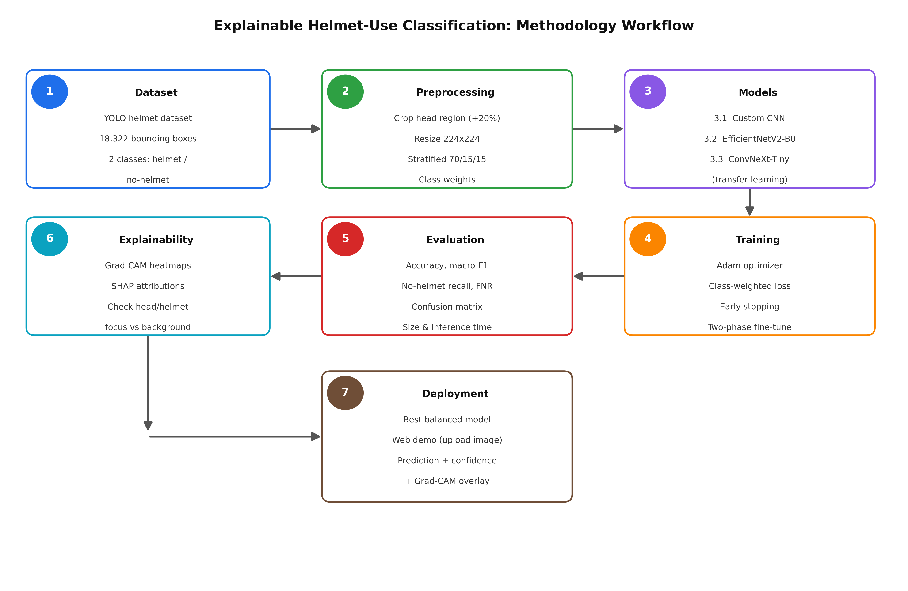
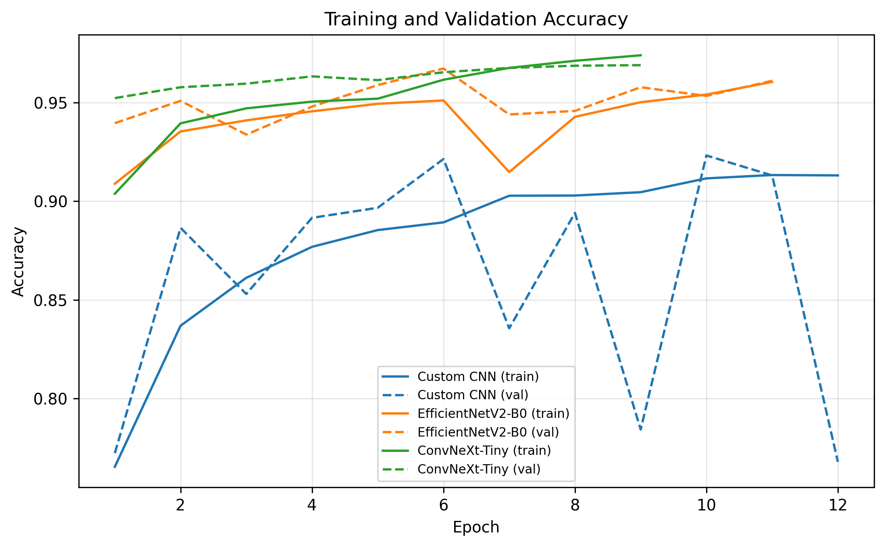
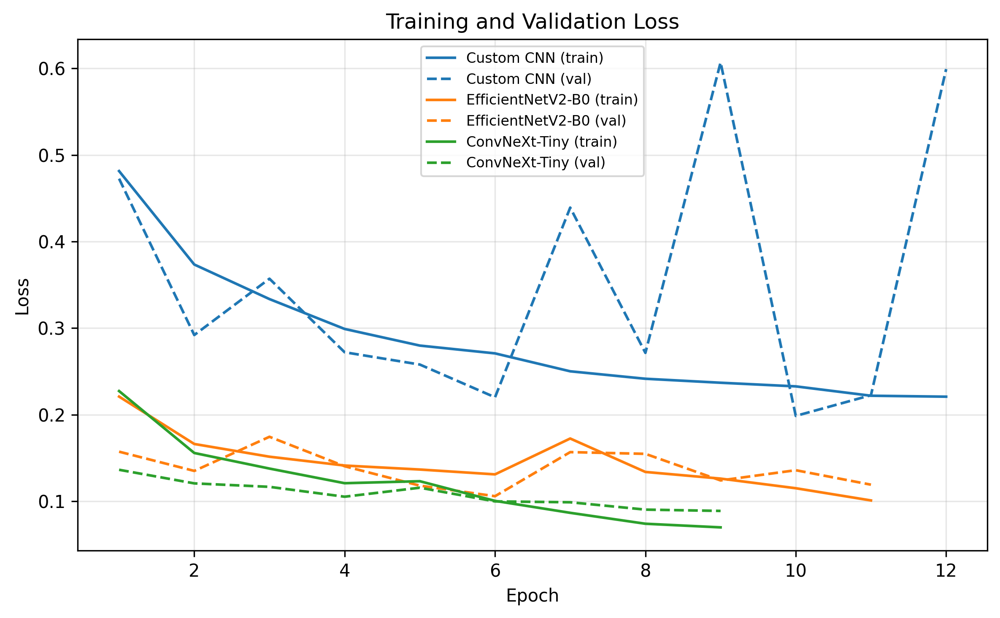
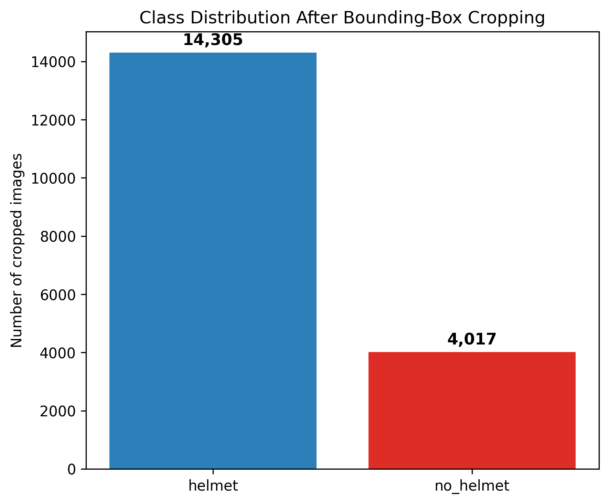
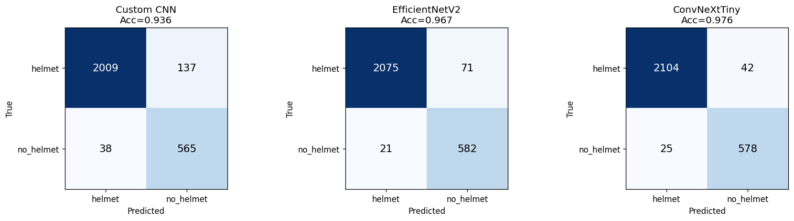
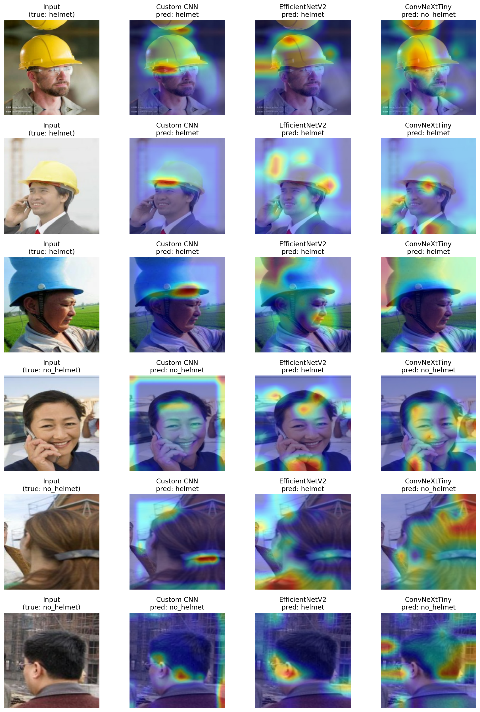
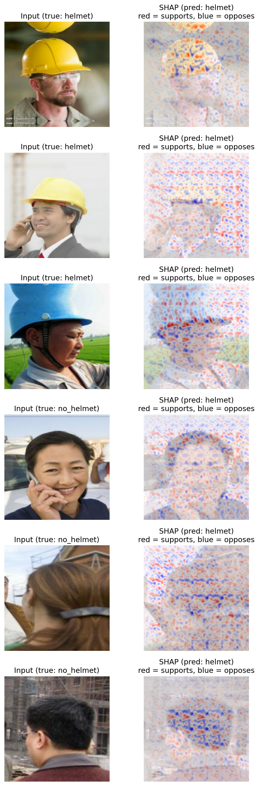

# Explainable CNN-Based Helmet-Use Classification for Intelligent Rider Safety Monitoring

Machine Learning & Smart Systems final project — University of Europe for Applied Sciences, Potsdam.

This project classifies whether a rider is wearing a helmet and explains every prediction with Grad-CAM and SHAP. Three CNN architectures are compared, and the best-balanced model is deployed as a live web demo.

The system is framed as a **rider-safety decision-support prototype with human review in the loop**, not as an automated enforcement tool.

---

## Live demo

**[Try it on Hugging Face Spaces](https://huggingface.co/spaces/efeyalcin/helmet-classification-xai)** — upload an image and get a prediction, a confidence score, and a Grad-CAM heatmap.

---

## Results (test set)

| Model | Accuracy | Macro-F1 | No-Helmet Recall | No-Helmet FNR | Inference (ms) | Size (MB) | Parameters |
|---|---|---|---|---|---|---|---|
| Custom CNN (from scratch) | 0.9363 | 0.9121 | 0.9370 | 0.0630 | 3.45 | 4.9 | 423,490 |
| EfficientNetV2-B0 (transfer) | 0.9665 | 0.9525 | **0.9652** | **0.0348** | 4.79 | 38.5 | 6,083,538 |
| ConvNeXt-Tiny (transfer) | **0.9756** | **0.9648** | 0.9585 | 0.0415 | 12.93 | 235.0 | 27,918,818 |

**Key finding:** the most accurate model is not the safest one. ConvNeXt-Tiny leads on accuracy, but EfficientNetV2-B0 catches more no-helmet riders (higher recall, lower false-negative rate) while being roughly 6x smaller and 2.7x faster. For a safety application, no-helmet recall matters more than overall accuracy — which is why EfficientNetV2-B0 was selected for deployment.

---

## Figures

### Methodology workflow


### Training and validation curves



The transfer-learning models converge quickly and stay stable. The custom CNN improves more slowly and its validation curve oscillates — a visible sign of the difficulty of training from scratch on an imbalanced dataset.

### Dataset class distribution


### Confusion matrices


### Explainability — Grad-CAM


### Explainability — SHAP


Both methods agree that predictions are driven mainly by the head and helmet region, though attention occasionally drifts to the background on harder images.

---

## Dataset

[Helmet or Without Helmet (Kaggle)](https://www.kaggle.com/datasets/quandmvn/helmet-or-without-helmet) — YOLO-annotated road images.

Each annotated bounding box is cropped with 20% padding around the head region, which reduces background interference. This produces a two-class classification dataset:

| Class | Total | Train | Val | Test |
|---|---|---|---|---|
| helmet | 14,305 | 10,014 | 2,146 | 2,145 |
| no_helmet | 4,017 | 2,810 | 603 | 604 |
| **Total** | **18,322** | **12,824** | **2,749** | **2,749** |

All crops are resized to 224x224 and split 70/15/15 in a stratified way. The classes are imbalanced (helmet is ~3.5x more frequent), so class weights (helmet 0.64, no_helmet 2.28) are applied during training to protect the safety-critical minority class.

---

## Models

- **Custom CNN** — four conv blocks (32/64/128/256), batch norm, max pooling, global average pooling, dropout, softmax. Trained from scratch, ~423K parameters.
- **EfficientNetV2-B0** — ImageNet-pretrained, two-phase fine-tuning (frozen backbone, then unfrozen top layers at a very low learning rate).
- **ConvNeXt-Tiny** — ImageNet-pretrained, same two-phase strategy.

All models use Adam, sparse categorical cross-entropy, early stopping, and learning-rate reduction on plateau.

---

## Explainability

- **Grad-CAM** — class-discriminative heatmaps from the last convolutional layer, showing which regions drove the prediction.
- **SHAP** — per-pixel attributions (gradient explainer), showing which regions support or oppose a prediction.

Augmentation layers inside the trained models interfere with gradient computation, so augmentation-free clones are created and the trained weights transferred by name before generating explanations.

---

## Repository structure

```
├── helmet_classification_xai.ipynb   # full pipeline: data prep, training, evaluation, Grad-CAM, SHAP
├── generate_figures.py               # regenerates the training curves and class-distribution figure
├── app.py                            # Hugging Face Spaces demo (Gradio)
├── requirements.txt
├── figures/                          # all figures used in the report
└── LICENSE
```

---

## Reproducing

The notebook runs end-to-end on Kaggle with a GPU (Tesla T4). Attach the dataset linked above, then run all cells. A fixed random seed (42) is used throughout.

To regenerate the report figures from the recorded training histories:

```bash
pip install matplotlib
python generate_figures.py
```

---

## Limitations

The models detect whether a helmet is *present*, not whether it is *correctly worn* — a rider holding a helmet may be classified as compliant. The dataset comes from a single source and may not cover extreme lighting, occlusion, or unusual headwear. Explanations show occasional background reliance, so the system is intended for human-reviewed decision support rather than autonomous enforcement.

---

## License

MIT — see [LICENSE](LICENSE).
